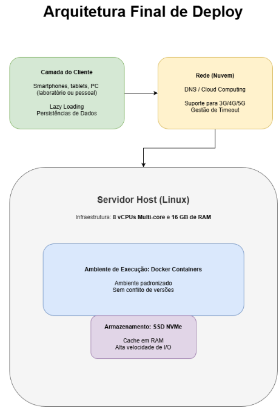

# Sistemas de Computação: O Desafio Final

## Introdução

Este trabalho detalha o planejamento de infraestrutura e o troubleshooting de um sistema de biblioteca digital acadêmica hospedado em Nuvem (Cloud Computing). O foco principal é assegurar a estabilidade e fluidez do acesso ao acervo, especialmente em períodos de alta demanda, como semanas de provas e entregas de TCC.

---

# 1. Infraestrutura e Arquitetura

A base do sistema foi projetada para utilizar recursos de Cloud Computing, garantindo que o acervo esteja disponível 24h por dia para os alunos:

**Perfil do usuário:**  
Estudantes universitários utilizando desktops (laboratórios), tablets e celulares via redes 3G/4G/5G.

**Capacidade de Processamento (CPU):**  
Servidor com 8 vCPUs Multi-core para gerenciar o volume de requisições e proteger a Main Thread de travamentos.

**Memória RAM:**  
16 GB para manter processos ativos em memória física, minimizando o uso de Swap e mantendo a performance.

**Armazenamento:**  
SSD NVMe em nuvem para garantir altíssima velocidade de leitura (I/O) de arquivos PDF.

**Sistema Operacional:**  
Linux, selecionado por sua estabilidade e eficiência na gestão de serviços de rede e containers.

---

# 2. Diagnóstico e Troubleshooting

Análise técnica de 10 incidentes críticos afetando a experiência do usuário:

---

## Incidente 1 (Erro 404 na Nuvem)

**Sintoma:**  
A imagem da capa de um livro aparece normalmente no computador do desenvolvedor, mas fica "quebrada" (Erro 404) quando o site é acessado no servidor Linux da biblioteca.

**Camada Afetada:**  
Arquivos.

**Análise:**  
No computador do desenvolvedor, o código aponta para um endereço fixo e local (ex: `C:\Users\Projeto\capa.jpg`). Quando o site vai para a nuvem (Linux), esse caminho não existe. Além disso, o Linux diferencia letras maiúsculas de minúsculas, então se o arquivo for `Capa.jpg` e o código pedir `capa.jpg`, ele não encontrará.

**Solução:**  

1. Alterar o código para usar **Caminhos Relativos** (endereços que funcionam em qualquer lugar, como `/imagens/capa.jpg`).  
2. Padronizar todos os nomes de arquivos com letras minúsculas para evitar erros de leitura no servidor.

---

## Incidente 2 (Acesso Negado 403)

**Sintoma:**  
O aluno clica para gerar o "Comprovante de Reserva" de um livro, mas a operação é interrompida silenciosamente e o arquivo não é baixado.

**Camada Afetada:**  
Sistema Operacional / Permissão.

**Análise:**  
O servidor Linux está configurado para proteger as pastas. O programa da biblioteca tenta "escrever" (criar) o arquivo do comprovante em uma pasta trancada, e o sistema operacional bloqueia a ação por segurança.

**Solução:**

1. Ajustar as permissões da pasta de destino no Linux para permitir que o sistema salve os arquivos gerados.  
2. Verificar se o usuário que executa o servidor tem os privilégios necessários para realizar operações de escrita.

---

## Incidente 3 (Falta de DNS)

**Sintoma:**  
O aluno tenta acessar a biblioteca pelo endereço oficial (ex: `www.bibliotecavirtual.com.br`), mas o navegador diz que o "Servidor não foi encontrado". Porém, se ele digitar o número do IP direto, o site abre.

**Camada Afetada:**  
Rede ou Domínio.

**Análise:**  
A equipe trocou o endereço (domínio) do site recentemente, mas a "lista telefônica" da internet (o DNS) ainda não foi atualizada. O navegador não sabe qual é o número de IP que corresponde ao novo nome da biblioteca.

**Solução:**

1. Verificar as configurações de apontamento no provedor do domínio.  
2. Aguardar o tempo de propagação do DNS (que pode levar algumas horas) para que o novo endereço funcione em todos os lugares.

---

## Incidente 4 (Timeout no Ônibus)

**Sintoma:**  
O aplicativo da biblioteca funciona perfeitamente no Wi-Fi da faculdade, mas trava na tela de carregamento infinita quando o aluno tenta acessar via 3G/4G dentro do ônibus, sem exibir nenhuma mensagem de erro.

**Camada Afetada:**  
Rede.

**Análise:**  
Timeout de Rede e Latência. A internet móvel é instável e mais lenta que o Wi-Fi. O aplicativo solicita os dados do livro, mas a conexão demora tanto que o tempo limite de espera (Timeout) acaba. Como o app não foi programado para avisar que a internet caiu, ele fica "preso" tentando carregar.

**Solução:**

1. Implementar uma mensagem de aviso após alguns segundos de espera (ex: "Sua conexão está lenta, tente novamente").  
2. Otimizar as imagens das capas dos livros para que sejam menores e carreguem mais rápido em redes instáveis.

---

## Incidente 5 (A Panela Derretendo)

**Sintoma:**  
Ao carregar telas com muitas imagens em alta resolução, o smartphone do estudante aquece excessivamente, a navegação apresenta "engasgos" (lags) e o aplicativo encerra abruptamente (crash).

**Camada Afetada:**  
Hardware.

**Análise:**  
Ocorre uma sobrecarga de Hardware devido ao processamento de arquivos não otimizados. O esforço excessivo gera um **Throttling Térmico**, reduzindo o desempenho para tentar resfriar o aparelho.

**Solução:**

1. **Lazy Loading:** carregar imagens apenas sob demanda.  
2. Compressão de imagens para reduzir o esforço do hardware.

---

## Incidente 6 (A Interface Congelada)

**Sintoma:**  
Ao pesquisar ou filtrar livros, a tela do celular "congela" por alguns segundos e os botões param de responder.

**Camada Afetada:**  
Software ou Hardware.

**Análise:**  
Ocorre o bloqueio da **Main Thread (linha de execução principal)**. O aplicativo tenta processar a busca pesada e renderizar imagens na mesma via que cuida dos toques do usuário. Como o processador está ocupado com o cálculo pesado, ele "esquece" de ouvir os comandos da tela.

**Solução:**

1. Mover o processamento pesado para **Worker Threads (segundo plano)**, liberando a Main Thread para a interface.  
2. Otimizar o algoritmo de busca para reduzir o esforço da CPU.

---

## Incidente 7 (Amnésia Digital)

**Sintoma:**  
O aluno está preenchendo um formulário de reserva de livro e minimiza o aplicativo para copiar uma informação no WhatsApp. Ao retornar, o aplicativo da biblioteca recarrega do zero e todos os dados preenchidos foram perdidos.

**Camada Afetada:**  
Hardware (Memória RAM) e Sistema Operacional.

**Análise:**  
Gerenciamento de Memória pelo SO (**OOM Killer – Out of Memory Killer**). Como o celular do aluno tem memória limitada, o Sistema Operacional decide encerrar processos em segundo plano para dar prioridade ao app que está sendo usado no momento (WhatsApp).

**Solução:**

1. Implementar **Salvamento de Estado (Persistence)**, onde o aplicativo grava os dados temporários no armazenamento local conforme o aluno digita.  
2. Configurar o app para recuperar automaticamente essas informações ao ser reiniciado.

---

## Incidente 8 (Vazamento de Memória)

**Sintoma:**  
O aplicativo da biblioteca possui um catálogo infinito de livros. Quanto mais o aluno rola a tela, mais lento o celular fica, até que o aplicativo fecha sozinho após cerca de 10 minutos.

**Camada Afetada:**  
Hardware.

**Análise:**  
**Memory Leak (Vazamento de Memória)**. O aplicativo carrega novos livros na memória RAM, mas não libera os que já saíram da tela.

**Solução:**

1. Implementar **Reciclagem de Objetos**.  
2. Utilizar **Virtualização de Lista**, carregando apenas os itens visíveis.

---

## Incidente 9 (Gargalo de Disco)

**Sintoma:**  
Em horários de pico (entregas de TCC), o sistema fica extremamente lento para abrir PDFs ou salvar pesquisas.

**Camada Afetada:**  
Hardware (Armazenamento/Disco).

**Análise:**  
Gargalo de **I/O em disco HDD**. O disco mecânico possui uma agulha física para leitura e não consegue atender múltiplas requisições simultâneas rapidamente.

**Solução:**

1. Substituir por **SSD NVMe**.  
2. Implementar **Cache em RAM** para livros mais acessados.

---

## Incidente 10 (Conflito de Deploy)

**Sintoma:**  
O programador criou uma função nova que funciona no computador dele, mas no servidor oficial o sistema inteiro para de funcionar.

**Camada Afetada:**  
Software / Sistema Operacional.

**Análise:**  
Diferença de versões e incompatibilidade entre ambientes.

**Justificativa:**

1. Utilizar **Containers (Docker)** para empacotar código e dependências.  
2. Garantir que o sistema rode igual em qualquer ambiente.

---

# 3. Definição do Ambiente de Execução

A arquitetura final substitui servidores tradicionais (bare-metal) e Máquinas Virtuais pesadas pelo uso de **Containers (Docker)**.

Essa tecnologia cria uma unidade isolada que empacota o código, bibliotecas e dependências, garantindo que o sistema funcione de forma idêntica tanto no desenvolvimento quanto na produção em nuvem.

A execução ocorrerá em um **servidor Linux**, aproveitando sua estabilidade e suporte nativo à conteinerização.

---

# Arquitetura Final de Deploy

O relançamento seguro do sistema baseia-se no seguinte fluxo de execução:

**Camada de Cliente:**  
App/Web otimizado com Lazy Loading e persistência de dados para economizar RAM e CPU dos dispositivos dos alunos.

**Camada de Rede:**  
Domínio configurado com DNS estável e suporte a latências de redes móveis (3G/4G/5G).

**Camada de Aplicação (Docker):**  
O sistema roda dentro de contêineres isolados, garantindo que picos de acesso não derrubem a aplicação principal e que o ambiente seja padronizado.

**Camada de Dados (SSD NVMe):**  
Armazenamento de alta performance para entrega imediata de PDFs, eliminando gargalos de leitura física.

